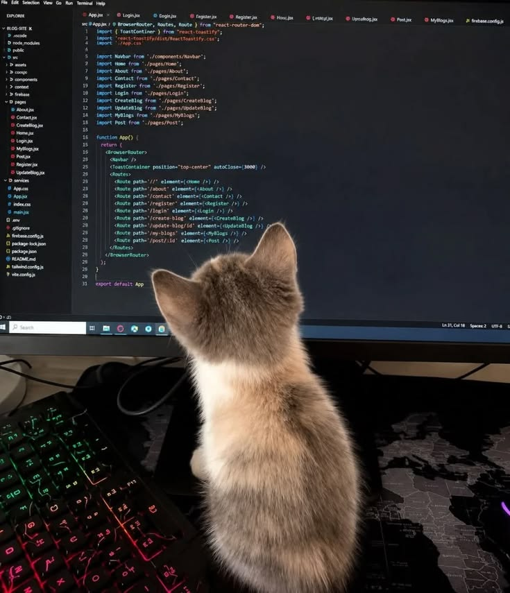

# Mi portafolio

Trabajos del curso Diseno de Interfaces de Programacion Avanzado.

## Sobre mi

Estudiante de Diseno y Desarrollo de Software en Tecsup.

## Contenido

### Trabajos del modulo 1

## Herramientas que uso

- **Git** para el control de versiones
- **GitHub** para el repositorio remoto
- _Visual Studio Code_ como editor

## Pasos para clonar este proyecto

1. Copiar la direccion desde el boton Code
2. Ejecutar git clone con esa direccion
3. Entrar a la carpeta con cd

## Mi avance del modulo

- [x] Laboratorio 01: Git basico
- [x] Laboratorio 03: Trabajo colaborativo
- [ ] Laboratorio 04: Markdown

## Enlaces utiles

- [Guia oficial de Markdown](https://www.markdownguide.org/)
- [Mi perfil de GitHub](https://github.com/TU-USUARIO)

## Captura de mi trabajo



## Comandos que mas uso

Para ver el estado del proyecto uso `git status`.

```bash git add . git commit -m "Actualiza el README" git push origin main

```

| Comando    | Que hace                   |
| ---------- | -------------------------- |
| git add    | Prepara los cambios        |
| git commit | Guarda la version          |
| git push   | Sube los cambios al remoto |

> Documentar es parte del trabajo, no un extra al final.

---

### 2. Puntos clave a tomar en cuenta

- **Código en línea:** El comando `` `git status` `` usa comillas invertidas simples (tecla `~` / `` ` ``).
- **Bloque de código:** Se abre con tres comillas invertidas seguidas de la palabra `bash` (`bash) y se cierra con tres comillas invertidas (`).
- **Tabla:** Es obligatorio incluir la línea de guiones `| --- | --- |` debajo de los encabezados de la tabla para que se renderice correctamente.
- **Cita:** Se crea agregando un símbolo mayor que `>` al inicio de la línea.

---

### 3. Verificar el resultado y tomar la captura

1. Presiona `Ctrl + Shift + V` en VS Code para abrir la **Vista previa**.
2. Confirma que la tabla tenga bordes, el código tenga fondo gris con color de sintaxis y la cita tenga una barra vertical a la izquierda.
3. Toma la captura de pantalla del editor junto a la vista previa para pegarla en tu documento de entrega del laboratorio.

<Elicitations message="¿Qué paso deseas realizar a continuación?">
  <Elicitation label="Hacer el Ejercicio 6" query="¿Cómo se hace el Ejercicio 6 para publicar los cambios en GitHub?"/>
  <Elicitation label="Ayuda con la comilla invertida" query="No me sale el símbolo de la comilla invertida en la terminal, ¿cómo lo escribo?"/>
</Elicitations>S
